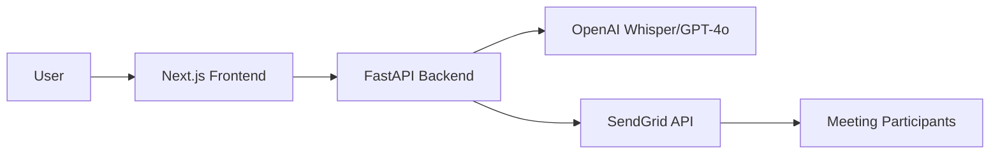

# Aura AI Meeting Assistant

A premium, privacy-first AI meeting assistant that generates summaries and action items without storing your data.

## Architecture

## Features

- **Privacy-First**: No database, no storage. All data is processed ephemerally.
- **Audio Processing**: High-quality transcription using Whisper.
- **Intelligent Summarization**: Notion-style summaries using GPT-4o.
- **Automated Tasking**: Task extraction and per-person email delivery.

## Setup Instructions

### Backend

1. Navigate to `/backend`.
2. Install dependencies: `pip install -r requirements.txt`.
3. Configure `.env` with your API keys.
4. Start the server: `python main.py`.

### Frontend

1. Navigate to `/frontend`.
2. Install dependencies: `npm install`.
3. Start the dev server: `npm run dev`.
4. Open [http://localhost:3000](http://localhost:3000).

## Dependencies

- **Backend**: FastAPI, OpenAI SDK, SendGrid SDK, Pydantic.
- **Frontend**: Next.js, React, Vanilla CSS.
